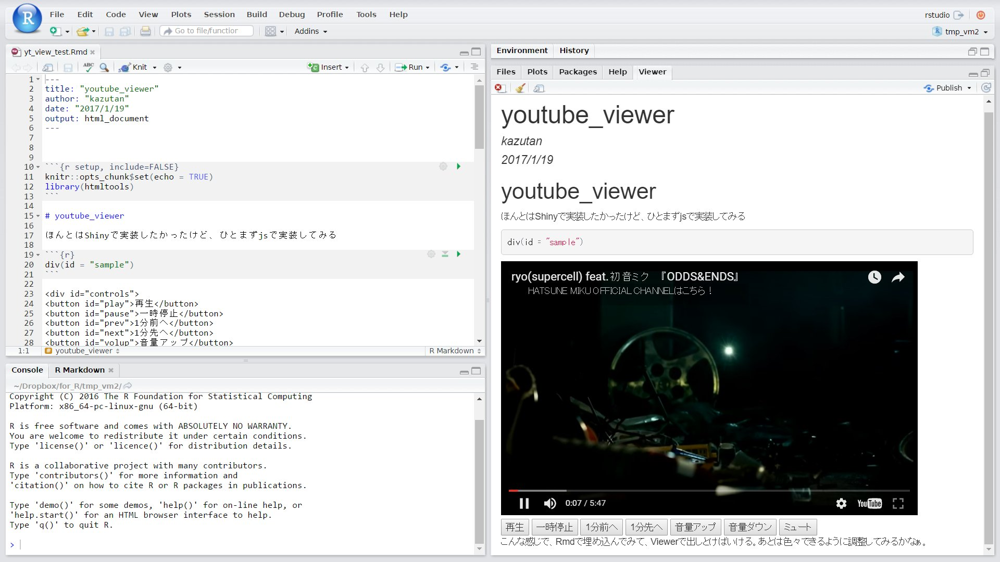

```{r setup, include=FALSE}
knitr::opts_chunk$set(echo = TRUE)

```

## 作業中にYouTube流していたい

- 作業用BGMがないと無理
    - 集中したい場合，私には必須
    - 最近はYouTubeでひたすらお気に入りを垂れ流す
- RStudioは画面を専有
    - できるだけ大きな画面で作業したい
    - ラップトップだといちいちウィンドウを出したり下げたり
    - てか作業してたら動画みれん

## どうすればいい?

- ウィンドウをtear(切り離す)
    - 画面を有効活用できる
    - 実際よくやってる
    - でも本体と分かれてるからそれはそれで面倒
- タブレットなど活用
    - 普段のデスク状況
    - でも出先では不便

## RStudio上で流せばいいんじゃね?

## RStudio Addinでは?

<div class="column1">
- ダイアログボックスで表示する
    - 出すことはできた
    - でも再生中はconsoleがListening...
    - これでは意味がない
</div>
<div class="column2">

</div>

## Rmdに埋め込んでKnit-Viewerでは?

<div class="column1">
- Rmdに埋め込んでViewerに表示する
    - 試しにjs~~コピペ~~駆使して実装してみた
    - これならconsole使える
    - でも違うmovieにするにはRmd書換&knit
    - 全く実用的じゃない
</div>
<div class="column2">

</div>

## 埋め込まれたhtmlを生成してViewerに表示?

- urlを与えたら，いい感じにhtmlを生成
- そのhtmlをviewerに表示させるようにすればいいんじゃね?
    - consoleにコマンド入力すれば再生してくれる
    - 自由に作業もできる
    - たぶん，これが一番いい感じ
- 前2つの技術でいけるんじゃね…?

## 関数つくってみた

```{r, eval=FALSE}
tubeplay <- function(url = "https://www.youtube.com/watch?v=iOFZKwv_LfA", 
                     width = "560", height = "315", background = "white",
                     viewer = getOption("viewer", utils::browseURL)) {
  # make video_id
  video_id <- gsub("^.*\\?v=", "", url)
  # make_ui
  ui <- miniUI::miniPage(
    htmltools::tags$iframe(width = width, height = height,
                src = paste("https://www.youtube.com/embed", video_id, sep = "/"),
                frameborder="0")
  )
  htmltools::html_print(ui)
}
```

- このコードは動きますが不十分な部分があります

## Yeah!!!!!!!


## OK, パッケージ化だ

- [`kazutan/tubeplayR`パッケージ](https://github.com/kazutan/tubeplayR)
    - 現在のversionは**v0.1.1**
        - さっきのコードから色々変えてます
    - 実行環境によってはうまく出てこないかも
        - ubuntuデスクトップ版だとうまくいかないかも
        - まあwinやMacなら大丈夫だと思います
        - {htmltools}と{miniUI}に依存

## 引数

url
: YouTubeのurl。embedの方ではないので注意。

viewer
: viewerを選択(実質使わない)。詳しくは`?htmltools::html_print`を参照

## 使い方

- 動作テスト
    - まずは`tubeplay()`を実行して動くかどうかテスト
- シングルで再生
    - Youtubeの再生用(not 埋め込み)URLをコピー
    - 引数にこのurlを渡して実行
- **プレイリストにも対応**
    - ブラウザでプレイリストを表示してurlをコピー
    - 引数にこのurlを渡して実行
    - **urlから自動的にどっちなのか判断**

## おすすめポイント

- Viewerのサイズに自動調整
    - レスポンシブに対応
    - Viewerいっぱいに広がります
- **CMが入りません**
    - 作ってから気付いた
    - ブラウザでプレイリスト流すよりもいい感じ
- urlをcsvとかで持っとくと楽
    - 名前付きベクトルもしくはリストで持っとく
    - あとはその要素を引き渡せばOK

## ToDo

- ヘルプ・ドキュメント整備
    - めんどくさくて後回しにしてます
    - なるべく早くやります
- YouTubeのAPIを使えるように
    - できれば探しにいけるようにしたい
    - そこまでやるならAddinで探しにいけるようにしたい
    - 余力があればそのうち

## Enjoy!

- `devtools::install_github("kazutan/tubeplayR")`
- `library("tubeplayR")`
- `tubeplay()`